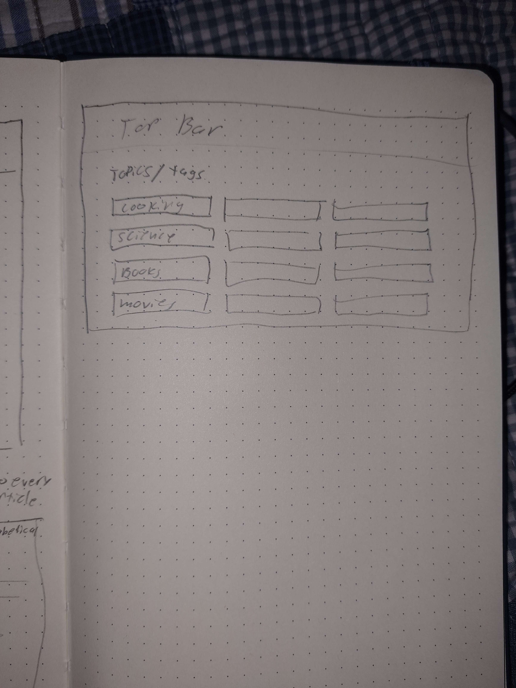

# Table of Contents

- [Overview](#Overview)
- [Architecture Diagram](#ArcDiagram)
- [Wireframe Drafts](#Wireframe)
- [User Stories](#Stories)
- [Requirements](#Requirements)
- [Uses Cases](#UseCases)
- [Uses Case Diagram](#UseDiagram)
- [ERD Diagram](#ERDDiagram)

 

# Online-Encyclopedia

An online encyclopedia similar to Wikipedia and TVTropes.org. Focusing on providing information on media such as books, webnovels, and anime.

# Overview

The functions of this online encyclopedia will include searching entries, storing data, hyperlinks to related articles, adding and editing pages, deleting pages, and showing statistics for what pages are available. The pages will have a tagging system, in case someone wants to browse them by topic, or wants to see related entries. It could so have user accounts that limit what a user can do if not logged in, for example editing or deleting entries. It would also be cool to have a history of changes made to any page for future reference.

# Architecture Diagram

# Wireframe Drafts

 

 

# User Stories

1. As a person looking up something specific, I need searching functionality so I don't waste time looking for the answer
2. As an moderator, I need a way to delete inappropriate content so the encyclopedia stays within its rules.
3. As a page editor and author, I need tools for styling, formatting, and adding content to pages so I can effectively contribute to the encyclopedia.
4. As a page author, I need of creating new pages for topics/articles which do not have them yet so they I can expand the scope of the encyclopedia.
5. As a curious person, I want links and suggested related topics to browse so that I can fall into a rabbit hole of interesting topics.

# Requirements

| 1   | The encyclopedia shall allow users to search for articles by keyword and tags. The search shall present a list of articles best matching the search, with options to refine the search such as sorting by date of creation.                                                                |
| --- | ------------------------------------------------------------------------------------------------------------------------------------------------------------------------------------------------------------------------------------------------------------------------------------------ |
| 2   | The encyclopedia shall allow authorized users to create new article pages, providing users with an interface to input information like title, keyworkds/tags, category, and description. It shall then bring the user to a page where they can write and edit the contents of the article. |
| 3   | The encyclopedia shall allow authorized users to edit existing articles, taking users to a page where the article's contents can be edited.                                                                                                                                                |
| 4   | The encyclopedia shall allow users to browse through an index of articles. It shall have options to sort the articles by category, tags, date of creation, and alphabetical order.                                                                                                         |
| 5   | The encyclopedia shall allow users to click on links to related articles within an article, if a related article exists.                                                                                                                                                                   |

# Use Cases

| Name of Use Case:  | Browsing                                                                                                                                                                                     |
| ------------------ | -------------------------------------------------------------------------------------------------------------------------------------------------------------------------------------------- |
| **Description:**   | A user browsing the contents of the online encyclopedia.                                                                                                                                     |
| **Actors:**        | Guest and registered user.                                                                                                                                                                   |
| **Goal:**          | View articles and be linked to related ones.                                                                                                                                                 |
| **Preconditions:** | The user is on the encyclopedia website                                                                                                                                                      |
| **Flow:**          | The encyclopedia facilitates a search or provides a list of available articles and topics. The user finds an article they have an interest in reading. The user goes to that article's page. |
| **Requirements:**  | Device to access the encyclopedia. Internet access.                                                                                                                                          |

| Name of Use Case:  | Searching                                                                                                                                                                                              |
| ------------------ | ------------------------------------------------------------------------------------------------------------------------------------------------------------------------------------------------------ |
| **Description:**   | A user searching the contents of the online encyclopedia.                                                                                                                                              |
| **Actors:**        | Guest, registered user, or moderator.                                                                                                                                                                  |
| **Goal:**          | Search for a particular article an have it be provided if it exists                                                                                                                                    |
| **Preconditions:** | The user is on the encyclopedia website                                                                                                                                                                |
| **Flow:**          | The encyclopedia provides a search bar. The user inputs their desired topic. The encyclopedia either provides the available topics, or informs the user that there is no topic of that type available. |
| **Requirements:**  | Device to access the encyclopedia. Internet access.                                                                                                                                                    |

| Name of Use Case:  | Adding Pages                                                                                                                                                                                                                                                                                                                                                                                                                                          |
| ------------------ | ----------------------------------------------------------------------------------------------------------------------------------------------------------------------------------------------------------------------------------------------------------------------------------------------------------------------------------------------------------------------------------------------------------------------------------------------------- |
| **Description:**   | A user browsing the contents of the online encyclopedia.                                                                                                                                                                                                                                                                                                                                                                                              |
| **Actors:**        | Registered user or moderator.                                                                                                                                                                                                                                                                                                                                                                                                                         |
| **Goal:**          | Be able to import or manually create new article pages.                                                                                                                                                                                                                                                                                                                                                                                               |
| **Preconditions:** | The user is on the encyclopedia website. The user has permission to add pages.                                                                                                                                                                                                                                                                                                                                                                        |
| **Flow:**          | The encyclopedia will have a button available for users who have permission to add a page. The user will be brought to a form page where they will input details of the page such as tags/topics, title, Description, etc. After finalizing this page, the user will be taken to a page where editing and adding the main content is possible. After the user is finished, they click the save/publish button, and the page is added to the database. |
| **Requirements:**  | Device to access the encyclopedia. Internet access. Sufficient permissions.                                                                                                                                                                                                                                                                                                                                                                           |

| Name of Use Case:  | Editing Pages                                                                                                                                                                                                                                                                                                                                                                              |
| ------------------ | ------------------------------------------------------------------------------------------------------------------------------------------------------------------------------------------------------------------------------------------------------------------------------------------------------------------------------------------------------------------------------------------ |
| **Description:**   | A user editing the contents or tags of an article/page                                                                                                                                                                                                                                                                                                                                     |
| **Actors:**        | Registered user or moderator.                                                                                                                                                                                                                                                                                                                                                              |
| **Goal:**          | Edit the contents of a page.                                                                                                                                                                                                                                                                                                                                                               |
| **Preconditions:** | The user is on the encyclopedia website, they have sufficient permission to edit.                                                                                                                                                                                                                                                                                                          |
| **Flow:**          | The encyclopedia will have a button available for users who have permission to edit a page, it will be near the add a page button. The user will be brought to the content editing page of the article, such as the one that appears after adding a page. After the user is finished, they click the save button, and the newly edited page is saved as the main page in the encyclopedia. |
| **Requirements:**  | Device to access the encyclopedia. Internet access. Permissions.                                                                                                                                                                                                                                                                                                                           |

| Name of Use Case:  | Deleting/Hiding pages                                                                                                                                                                                                                                                                                                                                                                                                                                                                                                                                                                                                                                              |
| ------------------ | ------------------------------------------------------------------------------------------------------------------------------------------------------------------------------------------------------------------------------------------------------------------------------------------------------------------------------------------------------------------------------------------------------------------------------------------------------------------------------------------------------------------------------------------------------------------------------------------------------------------------------------------------------------------ |
| **Description:**   | A moderator deleting or hiding a rule-violating article.                                                                                                                                                                                                                                                                                                                                                                                                                                                                                                                                                                                                           |
| **Actors:**        | Moderator                                                                                                                                                                                                                                                                                                                                                                                                                                                                                                                                                                                                                                                          |
| **Goal:**          | Delete or hiding rule-violating articles.                                                                                                                                                                                                                                                                                                                                                                                                                                                                                                                                                                                                                          |
| **Preconditions:** | The user is on the encyclopedia website. The user has sufficient permissions.                                                                                                                                                                                                                                                                                                                                                                                                                                                                                                                                                                                      |
| **Flow:**          | For moderators there will be an additional button that allows for the deletion or hiding of articles, as well as the article's history. It will be next to the edit and add buttons. When a moderator clicks this button, they will be taken to a page with options to hide and delete the article, as well as hide or delete the article's edit history. They will have to provide a reason for the hiding/deletion, and confirm that they understand that deletion is permanent. After confirmation of deletion, the article will be wiped form the database. After hiding an article, it will stay in the database, but will not be available to regular users. |
| **Requirements:**  | Device to access the encyclopedia. Internet access. Permissions.                                                                                                                                                                                                                                                                                                                                                                                                                                                                                                                                                                                                   |

# Use Case Diagram

<a id="ERDDiagram">
# ERD Diagram
